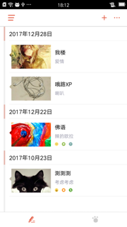
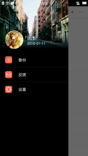
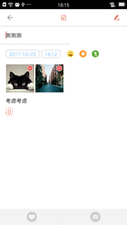
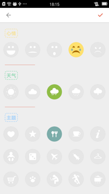
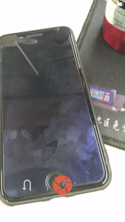
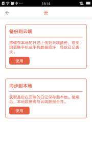
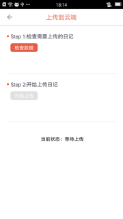
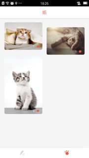
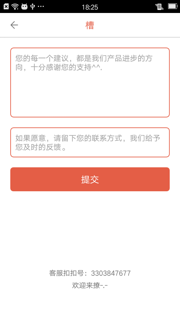

拾记
================================

## About
一个学习性的应用，目的是提供一款`便捷、单肩、高效记录日记`的工具，附加`贴纸库`，以便用户快速找到符合自己日记的贴纸。  

Fork & Star，都无尽感谢。

   

   

   

## Features
* **记录日记**
* **备份日记**（本地到云端）
* **同步日记**（云端到本地）
* **分享日记**（制作成书签分享社区）
* **注册账号**（手机号注册，发送验证码）
* **登录账号**
* **贴纸下载**
* **贴纸点赞**（用户级别）

## Framework
* 网络框架：volley
* 图片框架：fresco
* View框架：butterknife
* 数据库框架：greendao
* 异步框架：rxjava

## License
如果使用到本项目代码，请Fork & Star支持一下，微薄的支持。
